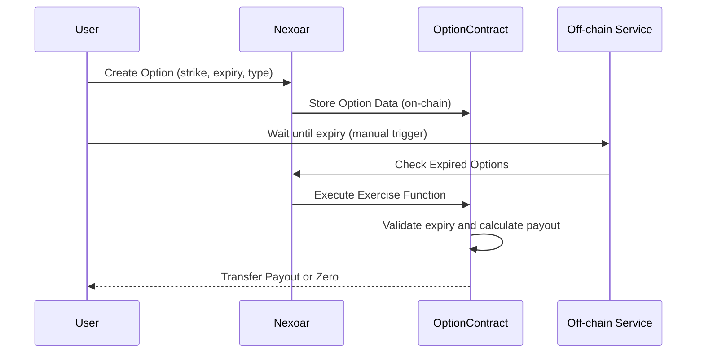
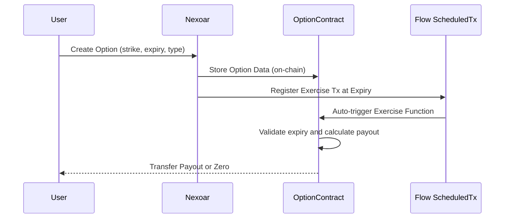

# Nexoar On Flow

Nexoar is a decentralized application for options trading on Flow, featuring robust liquidity management. Users can provide liquidity to earn fees, and our locked liquidity mechanism ensures payouts are secure and predictable. The protocol includes a comprehensive, on-chain premium calculation logic designed for efficiency and transparency.

## On-Chain Options Pricing - Rationale and Approach

Traditional options pricing models like Black-Scholes are mathematically complex and computationally expensive for on-chain execution. Nexoar’s formula is engineered to closely mimic Black-Scholes behavior while remaining practical for smart contracts. This approach balances accuracy and performance, enabling real-time, decentralized options pricing without the heavy resource demands of floating-point math and advanced functions.

Below is a comparison between the Black-Scholes model and Nexoar’s on-chain formula:

## Premium Calculation Logic

### 1. Intrinsic Value

$$
\text{Intrinsic} =
\begin{cases}
\max(\text{spot} - \text{strike},\ 0) & \text{if call} \\\\
\max(\text{strike} - \text{spot},\ 0) & \text{if put}
\end{cases}
$$

### 2. Time Value

$$
\text{TimeValue} =
\underbrace{
\frac{\text{strike} \cdot \sigma \cdot \sqrt{T} \cdot C}{1}
}_{\text{ATM time value}}
\cdot
\underbrace{
\max\left(0,\ 1 - \frac{moneyness_{pct}}{D_{max}}\right)
}_{\text{moneyness decay}}
$$

Where:

- $\sigma = 0.80$ (annualized volatility, 80%)
- $T = \frac{duration_{days}}{365}$
- $C = 0.496$ (time value coefficient)
- $moneyness_{pct} = \frac{|spot - strike|}{strike}$
- $D_{max} = 1.0$ (max moneyness distance, 100%)

### 3. Total Premium

$$
\text{Premium} = \text{Intrinsic} + \text{TimeValue}
$$

## Automated Option Exercise with Flow Scheduled Transactions

The Flow blockchain now supports scheduled transactions, which significantly simplifies our system design.

In the past, exercising options at expiry required an off-chain script or service to trigger the exercise function.
With scheduled transactions, the entire process is now fully automated and decentralized — no external infrastructure or cron jobs needed.

Below are two diagrams illustrating the flow before and after using scheduled transactions.

Explanation:

- User creates an option.
- At expiry, an off-chain service or user must trigger the exercise manually.
- This requires extra infrastructure (e.g., a backend cronjob or bot).

Explanation:

- When user creates the option, NexShore also registers a scheduled transaction.
- At expiry, Flow blockchain automatically triggers the exerciseOption() call.
- No external bot or infra is needed, fully on-chain automation.

